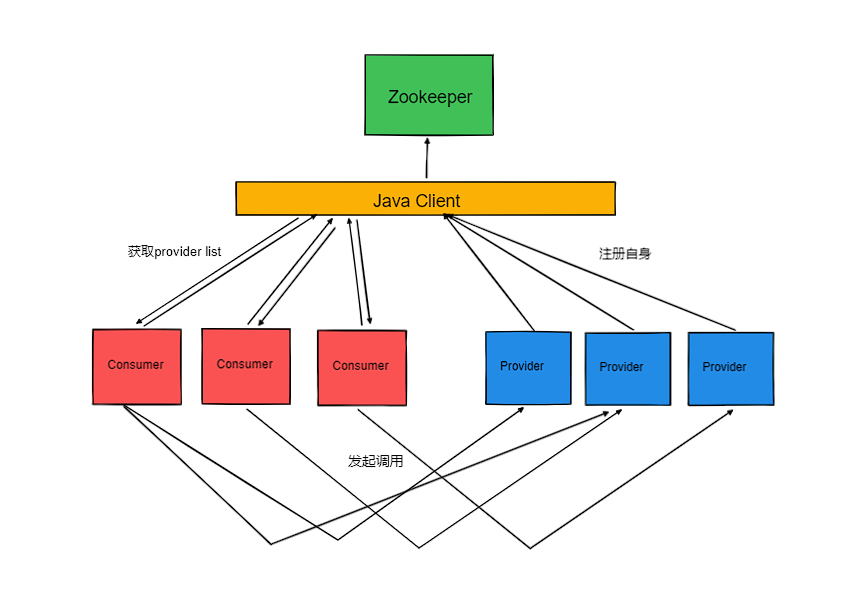
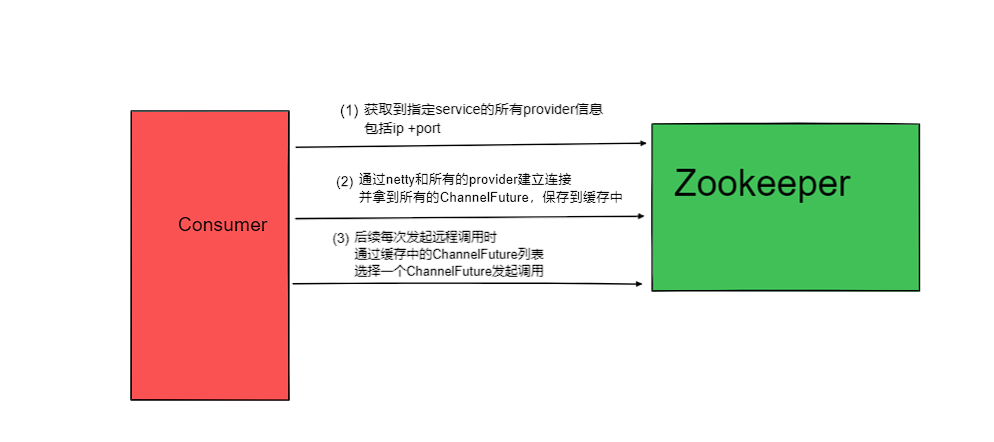

# IRpc **手写RPC框架v2-整合注册中心模块设计与实现**

**思考**
- 如果同一个服务有10台不同的机器进行提供，那么客户端该从哪获取这10台目标机器的ip地址信息呢？
- 随着调用方的增加，如何对服务调用者的数据进行监控呢？
- 服务提供者下线了，该如何通知到服务调用方？

**实现的功能**
- [x] 基于zookeeper作为注册中心进行了统一的访问接口封装与实现，并且能够支持日后其他注册中心的拓展。
- [x] 当服务提供方发生变更的时候，借助注册中心通知到客户端做本地调用表的一个更新操作。
- [x] 当服务订阅的时候需要告知注册中心修改节点数据，方便日后可以针对调用者做一些数据统计与监控的功能。
- [x] 统一将节点的更新后的相关操作通过事件的机制来实现代码解偶。
- [x] 将项目中常用的一些缓存数据按照服务端和客户端两类角色进行分开管理。
- [x] 将对于netty连接的管理操作统一封装在了ConnectionHandler类中，以及将之前硬编码的配置信息都迁移到了properties配置文件中，并设计了PropertiesBootst rap类进行管理。

**架构图**

## 接入注册中心

### 抽象注册中心相关操作
方便扩展多种注册中心
```java
public interface RegistryService {
    
    void register(URL url);
    
    void unRegister(URL url);
    
    void subscribe(URL url);

    void doUnSubscribe(URL url);

}
```
### 通过`curator`封装Zookeeper相关api
```java
public class CuratorZookeeperClient extends AbstractZookeeperClient {

    private static Logger logger = LoggerFactory.getLogger(CuratorZookeeperClient.class);

    private CuratorFramework client;

    public CuratorZookeeperClient(String zkAddress) {
        this(zkAddress, null, null);
    }

    public CuratorZookeeperClient(String zkAddress, Integer baseSleepTimes, Integer maxRetryTimes) {
        super(zkAddress, baseSleepTimes, maxRetryTimes);
        //重试策略
        ExponentialBackoffRetry retryPolicy = new ExponentialBackoffRetry(super.getBaseSleepTimes(), super.getMaxRetryTimes());
        if (client == null) {
            client = CuratorFrameworkFactory.newClient(zkAddress, retryPolicy);
            client.start();
        }
    }
    ...省略部分代码...
}
```

### 实现Zookeeper注册中心相关api
需要注意的是我们会在`doAfterSubscribe`中添加一个监听，监听是否有新的Provider注册，当监听到后会通过指定的事件通知Client进行变更操作
```java
public class ZookeeperRegister extends AbstractRegister implements RegistryService {

    private static Logger logger = LoggerFactory.getLogger(ZookeeperRegister.class);

    private AbstractZookeeperClient zkClient;

    private String ROOT = "/irpc";

    public ZookeeperRegister(String address) {
        this.zkClient = new CuratorZookeeperClient(address);
    }

    @Override
    public void doAfterSubscribe(URL url) {
        String newServerNodePath = ROOT + "/" + url.getServiceName() + "/provider";
        //监听是否有新的服务注册
        watchChildNodeData(newServerNodePath);
    }

    private void watchChildNodeData(String newServerNodePath) {
        zkClient.watchChildNodeData(newServerNodePath, watchedEvent -> {
            logger.info("监听到事件：{}",watchedEvent);
            String path = watchedEvent.getPath();
            List<String> childrenDataList = zkClient.getChildrenData(path);
            URLChangeWrapper urlChangeWrapper = new URLChangeWrapper();
            urlChangeWrapper.setProviderUrl(childrenDataList);
            urlChangeWrapper.setServiceName(path.split("/")[2]);

            //自定义的事件监听组件
            //当某个节点的数据发生更新后，会发送一个节点更新的事件，然后在事件的监听端对不同的行为做不同的事件处理操作
            IRpcEvent iRpcEvent = new IRpcUpdateEvent(urlChangeWrapper);
            IRpcListenerLoader.sendEvent(iRpcEvent);

            //zk节点的消息通常只具有一次性的功效，所以可能会出现第一次修改节点之后发送一次通知，之后再次修改节点之后不会再发送节点变更通知
            //因此收到回调之后，需要在注册一次监听，这样能保证一直都有收到消息
            watchChildNodeData(path);
        });

    }
    ...省略部分代码...
}
```

## 公共模块
### 对一次调用的封装
```java
public class RpcInvocation {

    /**
     * 请求的目标方法，例如finderUser
     */
    private String targetMethod;

    /**
     * 请求的目标服务名称，例如：cn.onenine.user.UserService
     */
    private String targetServiceName;

    /**
     * 请求参数信息
     */
    private Object[] args;

    /**
     * 用于匹配请求和响应的一个关键值，当请求从客户端发出的时候，会有一个uuid用于记录发出的请求
     *  待数据返回的时候通过uuid来匹配对应的请求线程，并且返回给调用线程
     */
    private String uuid;

    /**
     * 接口响应的数据塞入这个字段中(如果是异步调用或者是void类型，这里就为空)
     */
    private Object response;
    ...省略部分代码...
}
```
### 将硬编码的配置信息抽离到配置文件中
```java
public class PropertiesBootstrap {

    private volatile boolean configIsReady;

    public static final String SERVER_PORT = "irpc.serverPort";

    public static final String REGISTER_ADDRESS = "irpc.registerAddr";

    public static final String APPLICATION_NAME = "irpc.applicationName";

    public static final String PROXY_TYPE = "irpc.proxyType";

    public static final String CALL_TIMEOUT = "irpc.call.timeout";

    public static ServerConfig loadServerConfigFromLocal(){
        try {
            PropertiesLoader.loadConfiguration();;
        }catch (IOException e){
            throw new RuntimeException("loadServerConfigFromLocal fail,e is  {}",e);
        }

        ServerConfig serverConfig = new ServerConfig();
        serverConfig.setPort(PropertiesLoader.getPropertiesInteger(SERVER_PORT));
        serverConfig.setApplicationName(PropertiesLoader.getPropertiesStr(APPLICATION_NAME));
        serverConfig.setRegisterAddr(PropertiesLoader.getPropertiesStr(REGISTER_ADDRESS));
        return serverConfig;
    }

    public static ClientConfig loadClientConfigFromLocal(){
        try {
            PropertiesLoader.loadConfiguration();;
        }catch (IOException e){
            throw new RuntimeException("loadClientConfigFromLocal fail,e is {}" , e);
        }

        ClientConfig clientConfig = new ClientConfig();
        clientConfig.setApplicationName(PropertiesLoader.getPropertiesStr(APPLICATION_NAME));
        clientConfig.setRegisterAddr(PropertiesLoader.getPropertiesStr(REGISTER_ADDRESS));
        clientConfig.setProxyType(PropertiesLoader.getPropertiesStr(PROXY_TYPE));
        clientConfig.setCallTimeout(Long.parseLong(Objects.requireNonNull(PropertiesLoader.getPropertiesStr(CALL_TIMEOUT))));
        return clientConfig;
    }
}
```

## Provider服务提供方
### 调用注册中心相关API注册服务
程序启动时可调用此API进行服务暴露注册
```java
public void exportService(Object serviceBean){
    if (serviceBean.getClass().getInterfaces().length == 0){
        throw new RuntimeException("service must had interfaces!");
    }
    Class<?>[] classes = serviceBean.getClass().getInterfaces();
    if (classes.length >1){
        throw new RuntimeException("service must only had one interfaces!");
    }
    if (registryService == null){
        registryService = new ZookeeperRegister(serverConfig.getRegisterAddr());
    }
    //默认选择该对象的第一个实现
    Class<?> interfaceClass = classes[0];
    PROVIDER_CLASS_MAP.put(interfaceClass.getName(),serviceBean);
    URL url = new URL();
    url.setServiceName(interfaceClass.getName());
    url.setApplicationName(serverConfig.getApplicationName());
    url.addParameter("host", CommonUtils.getIpAddress());
    url.addParameter("port",String.valueOf(serverConfig.getPort()));
    PROVIDER_URL_SET.add(url);
}

/**
 * 异步注册
 */
private void batchExportUrl() {

    Thread task = new Thread(() -> {
        try {
            Thread.sleep(2500);
        } catch (InterruptedException e) {
            throw new RuntimeException(e);
        }
        for (URL url : PROVIDER_URL_SET) {
            registryService.register(url);
        }
    });

    task.start();

}
```


## Consumer服务调用方 

### 封装对通过netty对provider的一系列连接API
可对provider发起连接、断开连接以及获取每个连接的ChannelFuture
```java
public class ConnectionHandler {

    /**
     * 核心的连接处理器
     * 专门用于负责和服务端构建连接通信
     */
    private static Bootstrap bootstrap;

    public static void setBootstrap(Bootstrap bootstrap) {
        ConnectionHandler.bootstrap = bootstrap;
    }

    /**
     * 构建单个连接通道，元操作
     * @param providerServiceName
     * @param providerIp
     * @throws InterruptedException
     */
    public static void connect(String providerServiceName,String providerIp) throws InterruptedException{
        if (bootstrap == null){
            throw new RuntimeException("bootstrap can not be null");
        }

        //格式错误类型的信息
        if (!providerIp.contains(":")){
            return;
        }
        String[] providerAddress = providerIp.split(":");
        String ip = providerAddress[0];
        int port = Integer.parseInt(providerAddress[1]);
        ChannelFuture channelFuture = bootstrap.connect(ip, port).sync();
        ChannelFutureWrapper channelFutureWrapper = new ChannelFutureWrapper();
        channelFutureWrapper.setChannelFuture(channelFuture);
        channelFutureWrapper.setHost(ip);
        channelFutureWrapper.setPort(port);
        SERVER_ADDRESS.add(providerIp);
        List<ChannelFutureWrapper> channelFutureWrappers = CONNECT_MAP.get(providerServiceName);
        if (CollectionUtil.isEmpty(channelFutureWrappers)){
            channelFutureWrappers = new ArrayList<>();
        }

        channelFutureWrappers.add(channelFutureWrapper);
        CONNECT_MAP.put(providerServiceName,channelFutureWrappers);
    }


    public static ChannelFuture createChannelFuture(String host, Integer port) throws InterruptedException {
        return bootstrap.connect(host,port).sync();
    }

    /**
     * 断开连接
     * @param providerServiceName 服务名
     * @param providerIp 服务提供者IP
     */
    public static void disConnect(String providerServiceName,String providerIp){
        SERVER_ADDRESS.remove(providerIp);
        List<ChannelFutureWrapper> channelFutureWrappers = CONNECT_MAP.get(providerServiceName);
        if (CollectionUtil.isNotEmpty(channelFutureWrappers)){
            channelFutureWrappers.removeIf(channelFutureWrapper ->
                    providerIp.equals(channelFutureWrapper.getHost() + ":" + channelFutureWrapper.getPort()));
        }
    }

    /**
     * 默认走随机策略获取ChannelFuture
     */
    public static ChannelFuture getChannelFuture(String providerServiceName){
        List<ChannelFutureWrapper> channelFutureWrappers = CONNECT_MAP.get(providerServiceName);
        if (CollectionUtil.isEmpty(channelFutureWrappers)){
            throw new RuntimeException("no provider exist for " + providerServiceName);
        }

        return channelFutureWrappers.get(new Random().nextInt(channelFutureWrappers.size())).getChannelFuture();
    }
}
```

### 异步发送任务
```java
class AsyncSendJob implements Runnable {

        public AsyncSendJob() {
        }

        @Override
        public void run() {
            while (true) {
                try {
                    //阻塞模式
                    RpcInvocation data = CommonClientCache.SEND_QUEUE.take();
                    //将RpcInvocation封装到RpcProtocol对象中，然后发送给服务端，这里正好对应了ServerHandler
                    String json = JSONObject.toJSONString(data);
                    RpcProtocol rpcProtocol = new RpcProtocol(json.getBytes());
                    ChannelFuture channelFuture = ConnectionHandler.getChannelFuture(data.getTargetServiceName());
                    channelFuture.channel().writeAndFlush(rpcProtocol);
                } catch (Exception e) {
                    e.printStackTrace();
                }
            }

        }
    }
```
## 剩余的问题
- 服务注册环节出现失败时，Provier应该进行定期重试机制，保证服务能够有多次注册的机会，实现自愈的效果；
- 注册中心挂了，这种情况对于已经建立连接的Provider和Consumer之间是不受影响的，但是如果此时任意一方出现了配置调整（权重变化，服务下线），另一方都是无感的。针对这种情况应该及时恢复注册中心，并且在恢复注册中心之后需要让原先的Provider和Consumer都收到通知，并且把数据重新同步。


